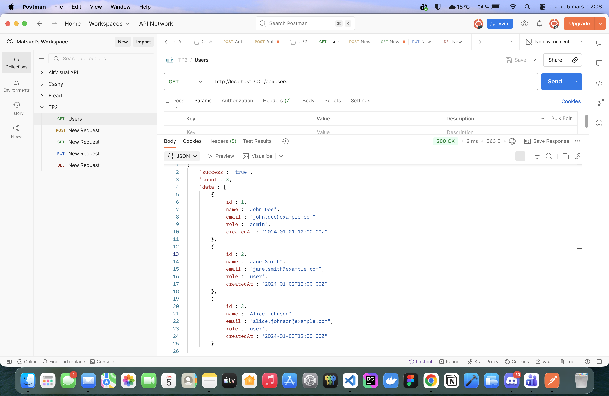
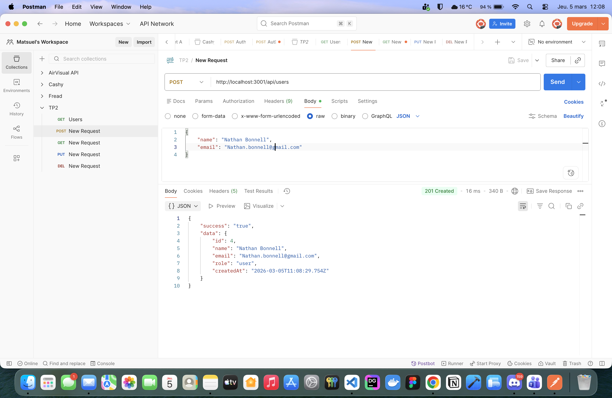
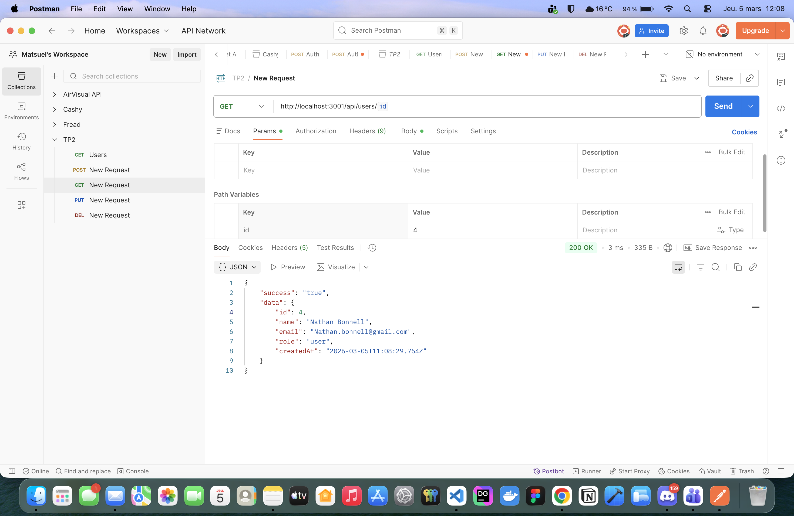
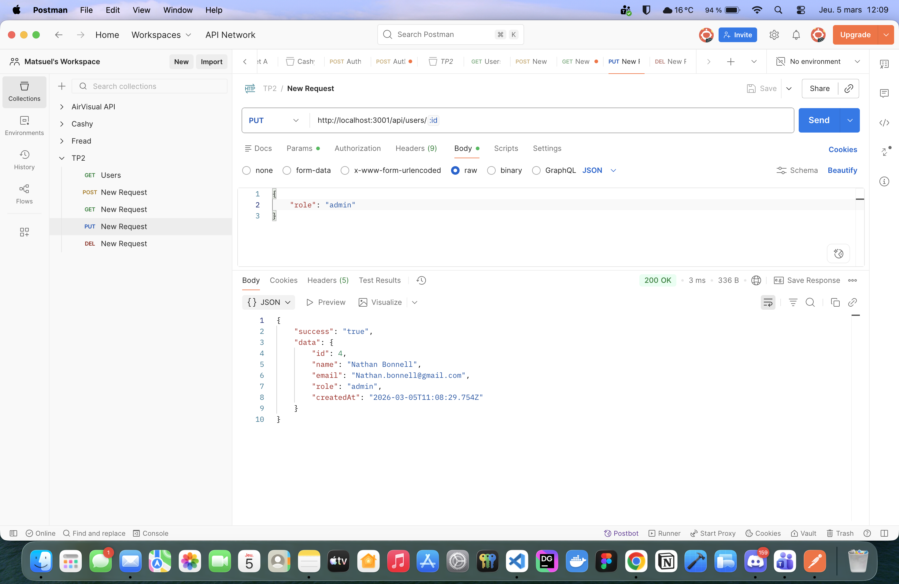
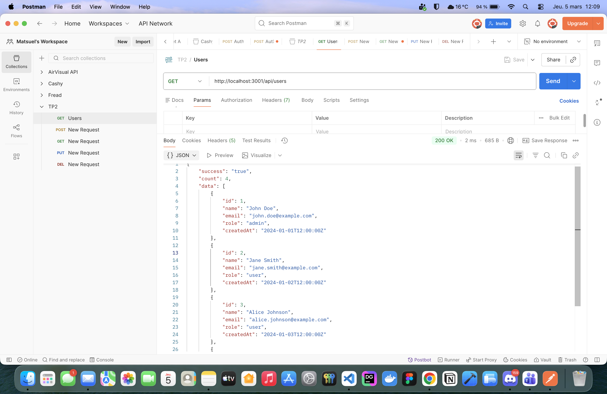
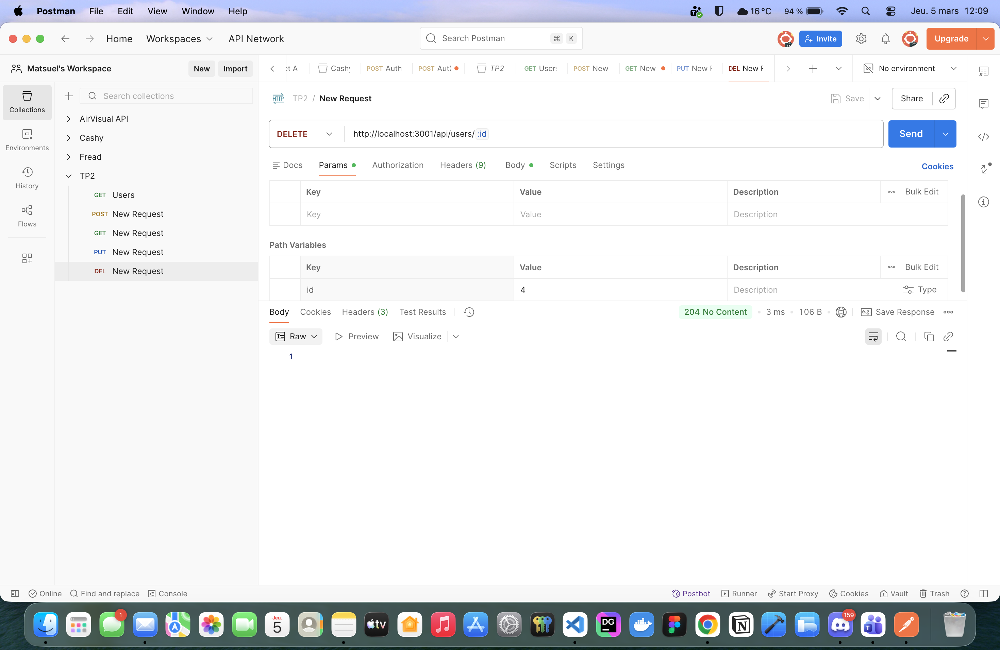
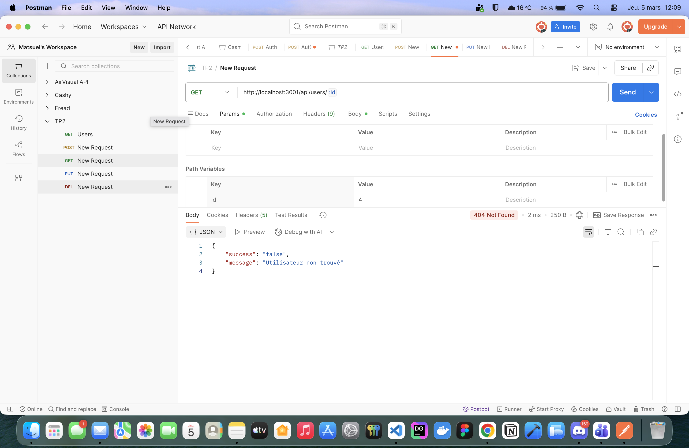

# TP2 — Matheo Lang

API REST Node.js / Express — Gestion d'utilisateurs  
**Auteur :** Matheo Lang  

---

## Prérequis

- [Bun](https://bun.com) v1.3.3+

## Installation

```bash
bun install
```

## Lancement du serveur

```bash
bun server.ts
```

Le serveur écoute sur **http://localhost:3001**.

---

## Architecture du projet

```
├── data/
│   └── users.ts              → Données initiales (tableau en mémoire)
├── models/
│   └── usersModel.ts         → Logique d'accès aux données (getAll, getById, create, update, remove)
├── controllers/
│   └── usersController.ts    → Traitement des requêtes HTTP et validation
├── routes/
│   └── users.ts              → Câblage des verbes HTTP vers les controllers
├── middleware/
│   └── logging.ts            → Middleware de logging des requêtes
└── server.ts                 → Point d'entrée, montage des middlewares et routes
```

---

## Modèle d'un utilisateur

```json
{
  "id": 1,
  "name": "Alice Martin",
  "email": "alice@example.com",
  "role": "admin",
  "createdAt": "2024-01-15T12:00:00Z"
}
```

---

## Documentation des routes

### Tableau récapitulatif

| Verbe HTTP | Route | Description | Statuts possibles |
|---|---|---|---|
| GET | `/` | Page d'accueil | 200 |
| GET | `/barrel-roll` | Redirection Google "do a barrel roll" | 302 |
| GET | `/api/users` | Lister tous les utilisateurs (filtre `?role=`) | 200 |
| GET | `/api/users/:id` | Obtenir un utilisateur par son id | 200, 404 |
| POST | `/api/users` | Créer un nouvel utilisateur | 201, 400, 409 |
| PUT | `/api/users/:id` | Mettre à jour un utilisateur (partiel) | 200, 400, 404 |
| DELETE | `/api/users/:id` | Supprimer un utilisateur | 204, 404 |

---

### GET `/`

Retourne un message de bienvenue.

**Exemple :**
```
GET http://localhost:3001/
```

**Réponse 200 :** `Hello, World!`

---

### GET `/barrel-roll`

Redirige vers la recherche Google "do a barrel roll".

**Exemple :**
```
GET http://localhost:3001/barrel-roll
```

**Réponse 302 :** redirection vers `https://www.google.com/search?q=do+a+barrel+roll`

---

### GET `/api/users`

Retourne la liste complète des utilisateurs.  
Filtrage possible via le query parameter `role`.

**Exemple :**
```
GET http://localhost:3001/api/users
GET http://localhost:3001/api/users?role=admin
```

**Réponse 200 :**
```json
{
  "success": "true",
  "count": 3,
  "data": [ ... ]
}
```

---

### GET `/api/users/:id`

Retourne un utilisateur par son identifiant.

**Exemple :**
```
GET http://localhost:3001/api/users/1
```

**Réponse 200 :**
```json
{
  "success": "true",
  "data": { "id": 1, "name": "John Doe", ... }
}
```

**Réponse 404 (introuvable) :**
```json
{
  "success": "false",
  "message": "Utilisateur non trouvé"
}
```

---

### POST `/api/users`

Crée un nouvel utilisateur. Les champs `name` et `email` sont obligatoires.

**Exemple :**
```
POST http://localhost:3001/api/users
Content-Type: application/json

{
  "name": "Bob Dupont",
  "email": "bob@example.com",
  "role": "user"
}
```

**Réponse 201 :**
```json
{
  "success": "true",
  "data": { "id": 4, "name": "Bob Dupont", ... }
}
```

**Réponse 400 (champs manquants) :**
```json
{
  "success": "false",
  "message": "Le nom et l'email sont requis pour créer un utilisateur"
}
```

**Réponse 409 (email déjà utilisé) :**
```json
{
  "success": "false",
  "message": "Un utilisateur avec cet email existe déjà"
}
```

---

### PUT `/api/users/:id`

Mise à jour partielle d'un utilisateur. Seuls les champs fournis sont modifiés.  
Les champs `id` et `createdAt` sont protégés et ignorés même s'ils sont envoyés.

**Exemple :**
```
PUT http://localhost:3001/api/users/4
Content-Type: application/json

{
  "role": "admin"
}
```

**Réponse 200 :**
```json
{
  "success": "true",
  "data": { "id": 4, "role": "admin", ... }
}
```

**Réponse 400 (aucun champ valide) :**
```json
{
  "success": "false",
  "message": "Aucun champ valide fourni pour la mise à jour"
}
```

**Réponse 404 :** même format que GET.

---

### DELETE `/api/users/:id`

Supprime un utilisateur. Retourne un statut **204 No Content** sans corps en cas de succès.

**Exemple :**
```
DELETE http://localhost:3001/api/users/4
```

**Réponse 204 :** *(corps vide)*

**Réponse 404 :**
```json
{
  "success": "false",
  "message": "Utilisateur non trouvé"
}
```

---

## Middleware de logging

Chaque requête est automatiquement loggée dans la console au format :

```
[2024-03-01 14:32:10] GET /api/users - 200 - 4ms
```

---

## Tests Postman — Scénario complet

### 1. GET `/api/users` — Liste des 3 utilisateurs initiaux (200)



---

### 2. POST `/api/users` — Création d'un nouvel utilisateur (201)



---

### 3. GET `/api/users/:id` — Récupération de l'utilisateur créé (200)



---

### 4. PUT `/api/users/:id` — Modification du rôle (200)



---

### 5. GET `/api/users` — Liste avec 4 utilisateurs (200)



---

### 6. DELETE `/api/users/:id` — Suppression de l'utilisateur (204)



---

### 7. GET `/api/users/:id` — Utilisateur supprimé introuvable (404)


