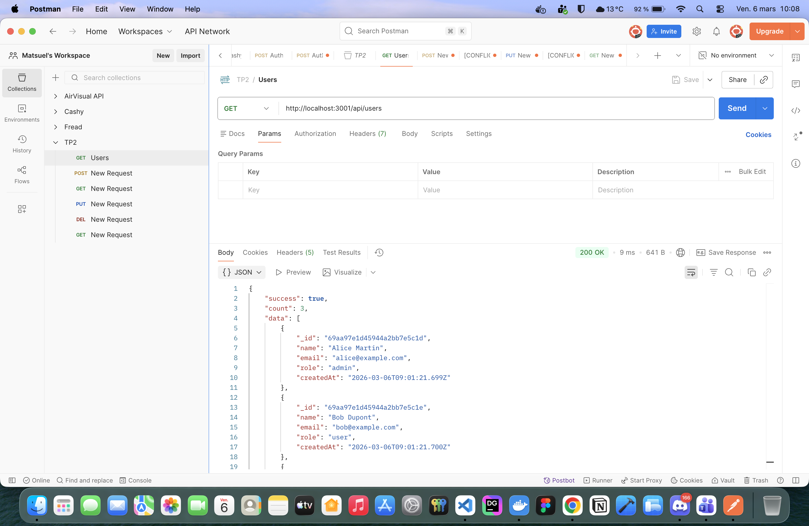
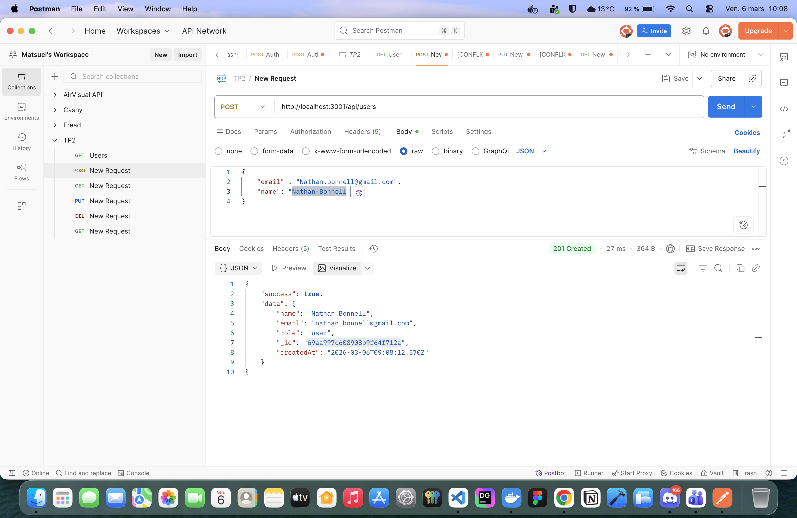
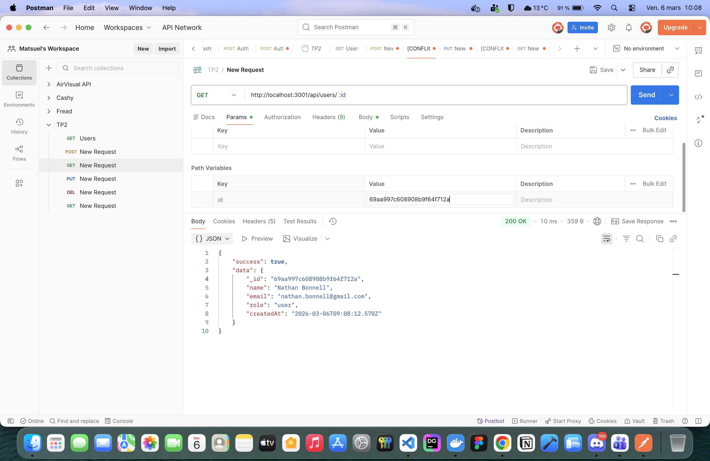
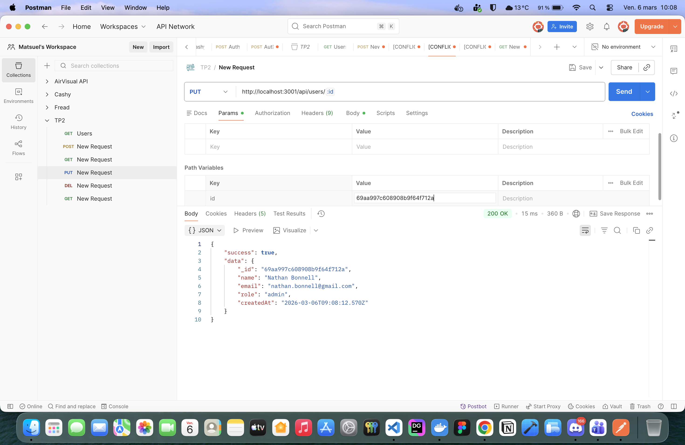
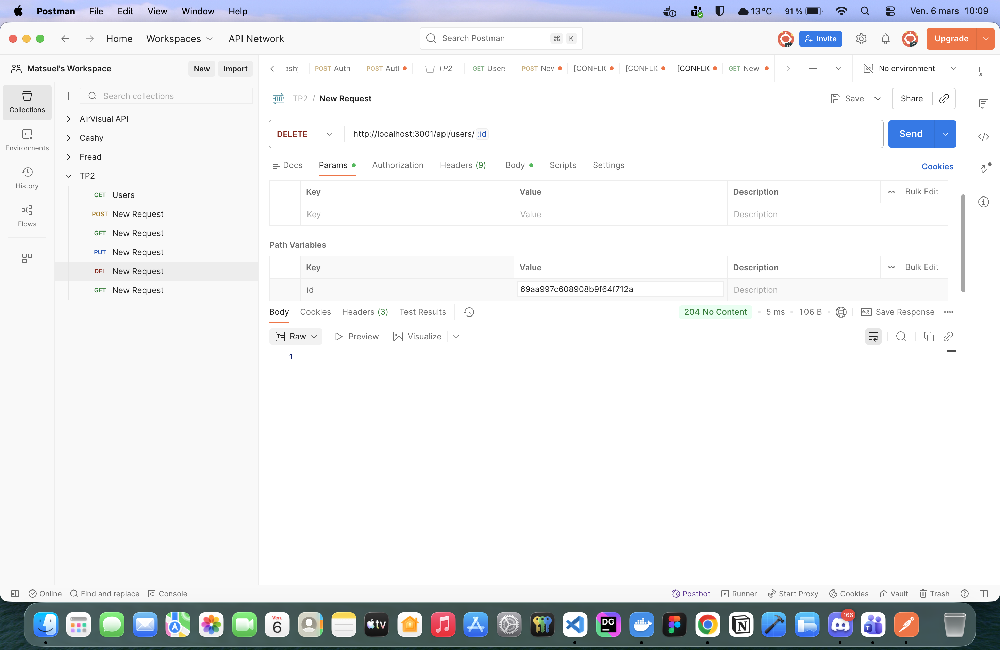
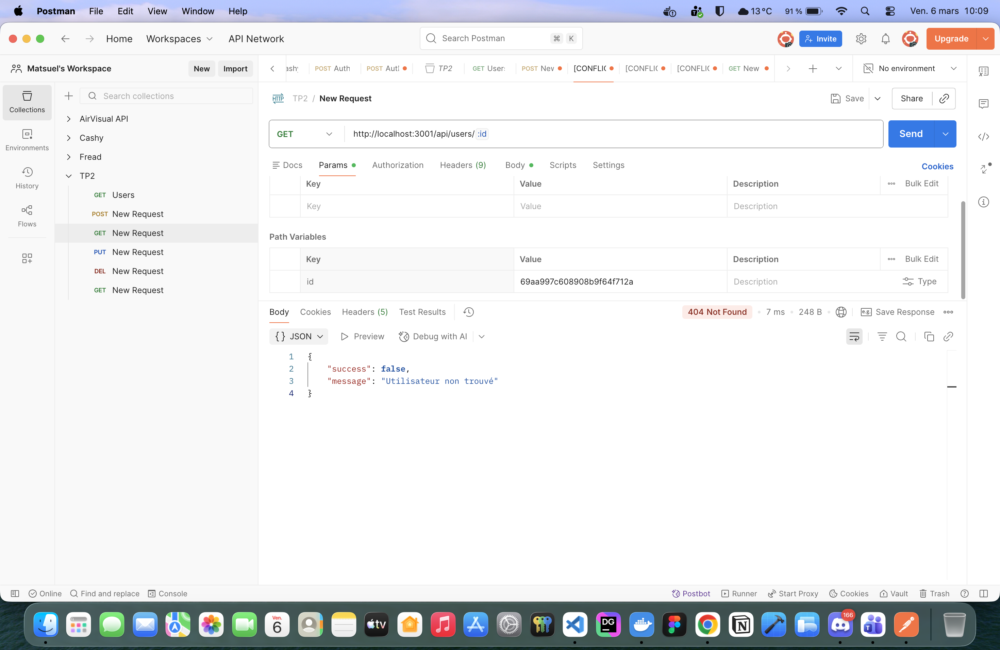
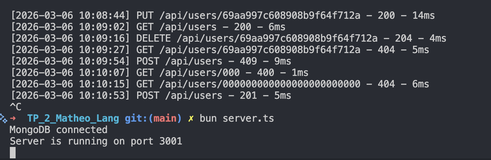
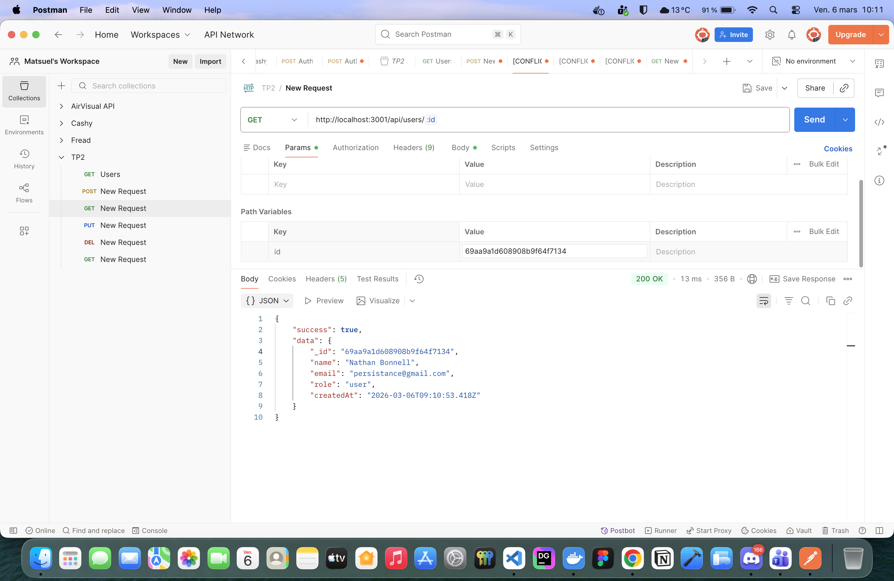

# TP3 — Matheo Lang

API REST Node.js / Express / MongoDB — Persistance des données  
**Auteur :** Matheo Lang

---

## Prérequis

- [Bun](https://bun.com) v1.3.3+
- [Docker](https://www.docker.com) (pour MongoDB)

## Installation

```bash
bun install
```

## Lancement de MongoDB

```bash
docker compose up -d
```

## Seed de la base de données

```bash
bun data/seed.ts
```

Insère 3 utilisateurs de test si la collection est vide.

## Lancement du serveur

```bash
bun server.ts
```

Le serveur écoute sur **http://localhost:3001**.

---

## Changements par rapport au TP2

| Aspect | TP2 | TP3 |
|---|---|---|
| Stockage | Tableau en mémoire | MongoDB (Mongoose) |
| Identifiant | `id` numérique | `_id` ObjectId |
| Persistance | Perdue au redémarrage | Conservée |
| Validation ID | Aucune | `mongoose.isValidObjectId()` |
| Erreur email dupliqué | Recherche manuelle | Index unique MongoDB (code 11000) |

---

## Modèle d'un utilisateur

```json
{
  "_id": "63f1a2b3c4d5e6f7a8b9c0d1",
  "name": "Alice Martin",
  "email": "alice@example.com",
  "role": "admin",
  "createdAt": "2026-03-06T08:46:29.223Z"
}
```

### Schéma Mongoose

| Champ | Type | Contraintes |
|---|---|---|
| `name` | String | required, trim |
| `email` | String | required, unique, lowercase |
| `role` | String | enum: ['admin','user'], default: 'user' |
| `createdAt` | Date | default: Date.now |

---

## Documentation des routes

### Tableau récapitulatif

| Verbe HTTP | Route | Description | Statuts possibles |
|---|---|---|---|
| GET | `/api/users` | Lister tous les utilisateurs (filtre `?role=`) | 200, 500 |
| GET | `/api/users/:_id` | Obtenir un utilisateur par son ObjectId | 200, 400, 404, 500 |
| POST | `/api/users` | Créer un nouvel utilisateur | 201, 400, 409, 500 |
| PUT | `/api/users/:_id` | Mettre à jour un utilisateur (partiel) | 200, 400, 404, 409, 500 |
| DELETE | `/api/users/:_id` | Supprimer un utilisateur | 204, 400, 404, 500 |

---

### GET `/api/users`

**Réponse 200 :**
```json
{
  "success": true,
  "count": 3,
  "data": [ ... ]
}
```

---

### GET `/api/users/:_id`

**Réponse 200 :**
```json
{
  "success": true,
  "data": { "_id": "...", "name": "Alice Martin", ... }
}
```

**Réponse 400 (ObjectId invalide) :**
```json
{ "success": false, "message": "ID invalide" }
```

**Réponse 404 :**
```json
{ "success": false, "message": "Utilisateur non trouvé" }
```

---

### POST `/api/users`

**Body :**
```json
{ "name": "Bob Dupont", "email": "bob@example.com" }
```

**Réponse 201 :**
```json
{
  "success": true,
  "data": { "_id": "...", "name": "Bob Dupont", ... }
}
```

**Réponse 409 (email déjà utilisé) :**
```json
{ "success": false, "message": "Un utilisateur avec cet email existe déjà" }
```

---

### PUT `/api/users/:_id`

Seuls les champs fournis sont modifiés. `_id` et `createdAt` sont ignorés.  
Utilise `findByIdAndUpdate` avec `returnDocument: 'after'` et `runValidators: true`.

**Body :**
```json
{ "role": "admin" }
```

**Réponse 200 :**
```json
{
  "success": true,
  "data": { "_id": "...", "role": "admin", ... }
}
```

---

### DELETE `/api/users/:_id`

**Réponse 204 :** *(corps vide)*

---

## Tests Postman — Scénario complet

### 1. GET `/api/users` — Liste des 3 utilisateurs après seed (200)

**Critères :** `count: 3`, `data` est un tableau



---

### 2. POST `/api/users` — Création d'un nouvel utilisateur (201)

**Critères :** `success: true`, `data._id` présent



---

### 3. GET `/api/users/:_id` — Récupération de l'utilisateur créé (200)

**Critères :** `data.name` correspond au nom saisi



---

### 4. PUT `/api/users/:_id` — Modification d'un champ (200)

**Critères :** champ modifié présent dans `data`



---

### 5. GET `/api/users` — Liste avec 4 utilisateurs (200)

**Critères :** `count: 4`


---

### 6. DELETE `/api/users/:_id` — Suppression (204)

**Critères :** corps vide



---

### 7. GET `/api/users/:_id` — Utilisateur supprimé introuvable (404)

**Critères :** `success: false`, message "non trouvé"



---

### 8. GET `/api/users/:_id` — ID au format invalide (400)


---

### 9. Redémarrage du serveur — Persistance vérifiée

Créez un utilisateur via POST, notez son `_id`, redémarrez le serveur (`Ctrl+C` puis `bun server.ts`), puis faites `GET /api/users/:_id` — l'utilisateur doit être retrouvé.



---

### 10. Résultat de la persistance


