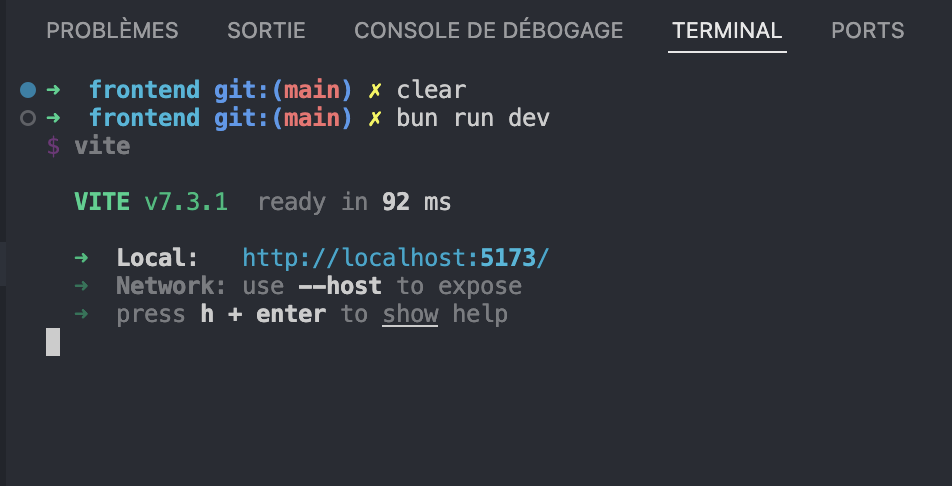
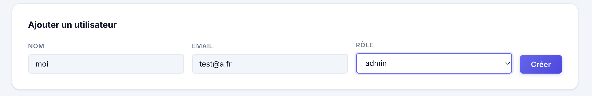
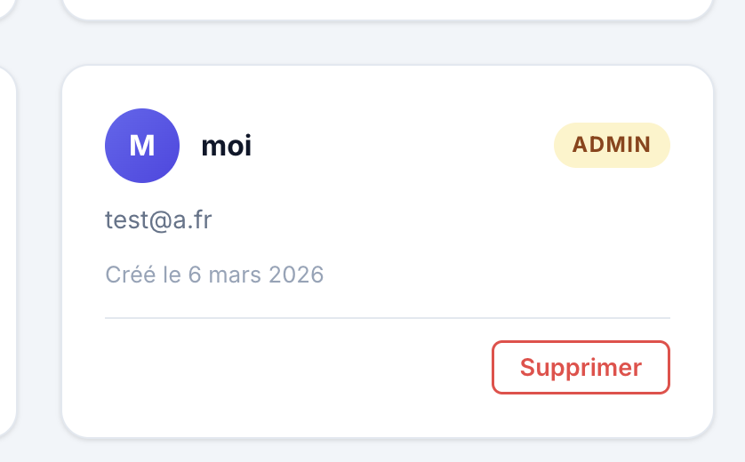
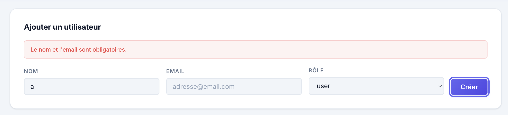
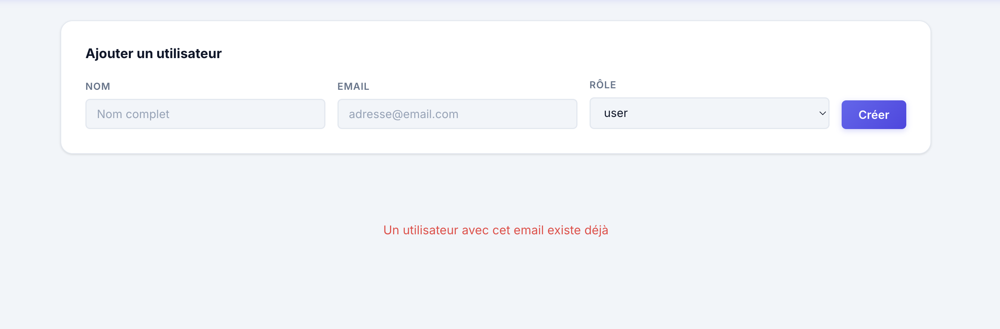
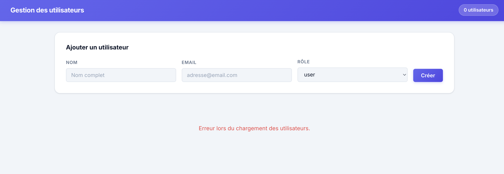
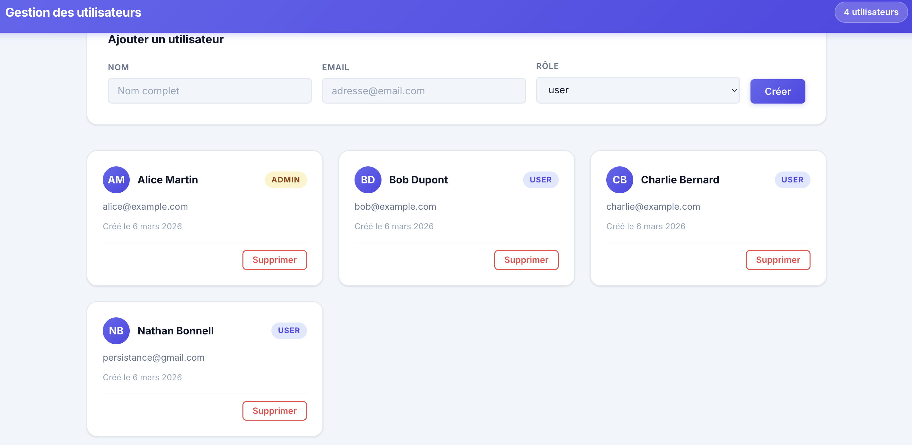

# TP4 — Matheo Lang

Frontend React / TypeScript — Interface de gestion des utilisateurs  
**Auteur :** Matheo Lang

---

## Prérequis

- [Bun](https://bun.com) v1.3.3+
- [Docker](https://www.docker.com) (pour MongoDB)
- Backend TP3 lancé sur **http://localhost:3001**

## Installation

```bash
cd frontend
bun install
```

## Lancement du frontend

```bash
bun dev
```

L'interface est accessible sur **http://localhost:5173**.

> Le proxy Vite redirige `/api` → `http://localhost:3001` (configuré dans `vite.config.ts`).

---

## Architecture du projet

```
frontend/src/
├── services/
│   └── userService.ts     → Instance axios + méthodes CRUD (getAll, getById, create, update, remove)
├── components/
│   ├── Navbar.tsx          → Barre de navigation (titre + compteur d'utilisateurs)
│   ├── UserForm.tsx        → Formulaire contrôlé de création d'utilisateur
│   ├── UserList.tsx        → Grille de cartes avec états loading / error / empty
│   └── UserCard.tsx        → Carte individuelle (avatar, badge rôle, suppression)
├── App.tsx                 → Chef d'orchestre : state global, useEffect, handlers
├── App.css                 → Styles des composants
└── index.css               → Variables CSS, reset, typographie (Inter)
```

---

## Composants

### `<Navbar count={users.length} />`
Barre sticky avec dégradé indigo. Affiche le titre et le nombre d'utilisateurs en temps réel.

### `<UserForm onSubmit={handleCreate} />`
Formulaire contrôlé avec champs `name`, `email`, `role`. Valide côté client avant tout appel API et vide les champs après soumission réussie.

### `<UserList users={users} loading={loading} error={error} onDelete={handleDelete} />`
Gère les trois états : chargement, erreur, liste vide. Affiche un `<UserCard>` par utilisateur dans une grille responsive.

### `<UserCard user={user} onDelete={handleDelete} />`
Carte avec avatar généré depuis les initiales, badge de rôle coloré, date formatée en français et bouton de suppression.

---

## Service API

**`src/services/userService.ts`** — Instance axios avec `baseURL: '/api'`

| Méthode | Appel HTTP | Description |
|---|---|---|
| `getAll()` | `GET /users` | Récupère tous les utilisateurs |
| `getById(id)` | `GET /users/:id` | Récupère un utilisateur par ID |
| `create(data)` | `POST /users` | Crée un nouvel utilisateur |
| `update(id, data)` | `PUT /users/:id` | Met à jour un utilisateur |
| `remove(id)` | `DELETE /users/:id` | Supprime un utilisateur |

---

## Scénarios de test

### Scénario 01 — Lancer le frontend

La liste des utilisateurs s'affiche (données persistées depuis le TP3 / MongoDB).



---

### Scénario 02 — Créer un utilisateur

Remplir et soumettre le formulaire. Le nouvel utilisateur apparaît dans la liste immédiatement, sans rechargement de page.



---

### Scénario 03 — Supprimer un utilisateur

Cliquer sur "Supprimer" dans une carte. L'utilisateur disparaît de la liste immédiatement via mise à jour du state React.



---

### Scénario 04 — Validation côté client (champ vide)

Soumettre le formulaire avec un champ vide. Un message d'erreur de validation s'affiche, aucun appel API n'est effectué.



---

### Scénario 05 — Erreur 409 (email déjà utilisé)

Soumettre avec un email déjà existant. L'API retourne un `409 Conflict` et le message d'erreur est affiché dans l'interface.



---

### Scénario 06 — Backend coupé

Couper l'API backend (Ctrl+C). Un message d'erreur de connexion s'affiche dans l'interface sans crash de l'application.



---

### Scénario 07 — Redémarrage de l'API

Redémarrer l'API et recharger la page. Les données persistent grâce à MongoDB (TP3).


